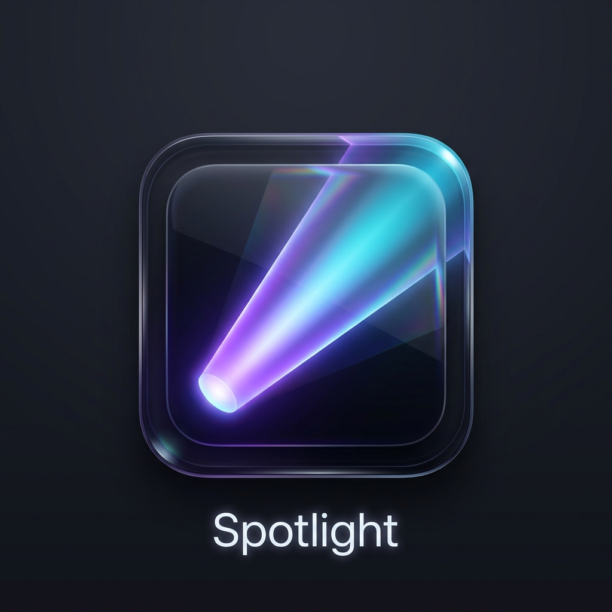

#  Spotlight for Windows

Spotlight is a premium, keyboard-driven search and command launcher for Windows, inspired by macOS Spotlight and Raycast. It combines a native **WPF (.NET 9) Host** with a modern **React + Vite + TypeScript UI** rendered inside WebView2, bringing web-level styling and animations to a native desktop container.

---

## Key Features

*   ⚡ **Quick Web Search (`?`)**: Instantly retrieve the first search result snippet (e.g. Wikipedia definitions, StackOverflow answers) in less than **1 second** using our direct JSON search API. No API keys required.
*   📂 **Fast File Search (`<`)**: Powered by the blazing-fast `fd` Rust-based CLI, searching your entire user profile directory instantly while ignoring system junk folders like `AppData` and `node_modules`.
*   📋 **Clipboard History (`Alt + C` / `*`)**: Logs up to 50 copied text items with monospace previews and character counts. Hitting `Enter` on any clipboard item auto-pastes it directly into your active window.
*   🛠️ **Prefix Query Modes**: Instantly route queries to commands, registry keys, services, settings, unit converters, and hashing engines.
*   🎨 **Premium Glassmorphism UI**: Beautiful, responsive layout featuring dynamic border reflections, soft backdrop blurs (`backdrop-filter: blur(35px)`), sleek typography, and keyboard-driven navigation.

---

## Prefix Query Modes

Type any of the following characters at the start of your search to trigger specialized utility engines:

| Prefix | Description | Example Query | Action on Enter |
| :---: | --- | --- | --- |
| `?` | **Quick Web Search** | `? speed of light` | Queries search API and displays first web result snippet |
| `<` | **Files Filter (`fd`)** | `< resume.pdf` | Performs a blazing fast files-only search using `fd` |
| `*` | **Clipboard History** | `* npm install` | Searches clipboard history; Enter to auto-paste item |
| `>` | **Command Runner** | `> ping 8.8.8.8` | Executes command in a new Command Prompt |
| `:` | **Registry Navigator** | `: HKCU\Software\Microsoft` | Opens Registry Editor focused directly on that key |
| `!` | **Services Manager** | `! wuauserv` | Lists Windows Services; toggles status (Start/Stop) |
| `$` | **Settings Search** | `$ update` | Lists and opens Windows Settings pages |
| `#` | **Hashes Generator** | `# hello` | Computes SHA-1 and SHA-256 hashes of input text |
| `%%` | **Unit Converter** | `%% 10 ft to m` | Performs length, weight, and temperature conversions |
| `.` | **Programs Filter** | `. chrome` | Searches Start Menu & Desktop application shortcuts |
| `!!` | **Action History** | `!!` | Displays the last 10 actions executed in Spotlight |

---

## Installation & Setup

We have compiled everything into a **single-file self-contained setup installer** (`SpotlightSetup.exe`) that bundles the app binaries, UI assets, dependencies, and `fd.exe` together.

### How to Install (for Users)
1. Download **`SpotlightSetup.exe`** from this repository.
2. **Double-click** `SpotlightSetup.exe`.
3. The installer will automatically:
   * Terminate any active older instances of the app.
   * Extract and install the app to `C:\Users\<username>\AppData\Local\Spotlight` (requires **zero administrator permissions**).
   * Bundles and configures the `fd` search utility locally.
   * Create a Start Menu shortcut named **Spotlight** for quick launching.
   * Add a registry startup run key under `HKCU` to run Spotlight silently in the background on system boot.
   * Launch the application immediately.

### Keyboard Shortcuts
*   **`Alt + Space`** (or `Ctrl + Space`): Toggle the launcher window.
*   **`Alt + C`**: Toggle the Clipboard History manager.
*   **`Ctrl + K`**: Toggle the Actions Menu for a selected file (e.g. *Copy File Path*, *Show in Explorer*, *Start/Stop Service*).
*   **`Esc`**: Hide the launcher window.

---

## Development & Build Instructions

If you wish to modify the source code and compile your own builds:

### Prerequisites
*   [.NET 9 SDK](https://dotnet.microsoft.com/download/dotnet/9.0)
*   [Node.js (v18+)](https://nodejs.org/)

### Build the Project
We configured a custom MSBuild Target inside the WPF project. Running a Release build automatically runs `npm run build` inside the React project and copies the static assets directly into the C# binary folder.

To compile a production bundle:
```powershell
# 1. Compile WPF & React together
dotnet publish src/Spotlight.App/Spotlight.App.csproj -c Release -r win-x64 --self-contained false -p:PublishSingleFile=true -p:PublishReadyToRun=true

# 2. Build the distributable self-contained installer (creates SpotlightSetup.exe)
powershell -ExecutionPolicy Bypass -File .\create_installer.ps1
```

---

> [!NOTE]
> Spotlight stores your local clipboard logs and configuration settings in `C:\Users\<username>\AppData\Local\Spotlight`. No telemetry or clipboard logs ever leave your machine.
